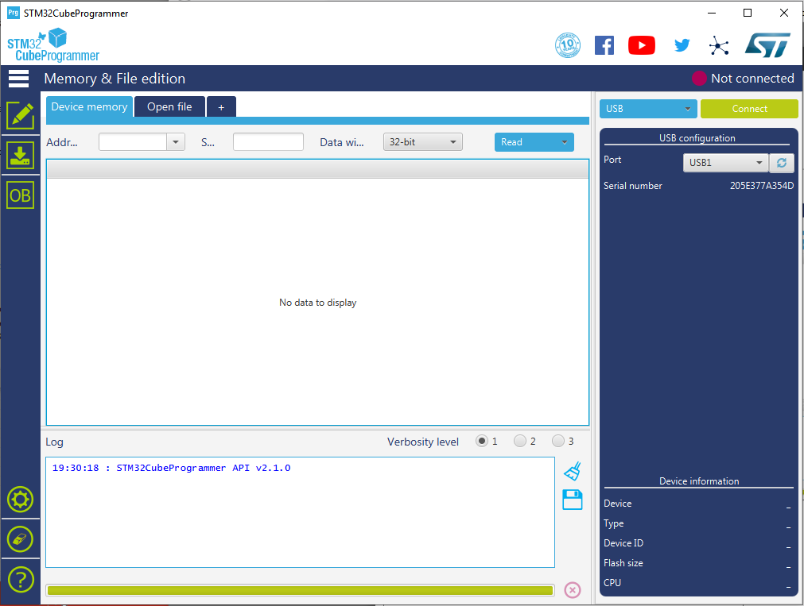
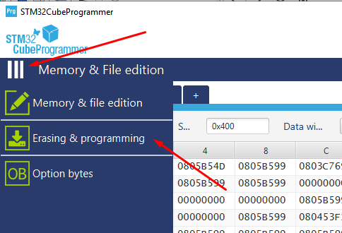
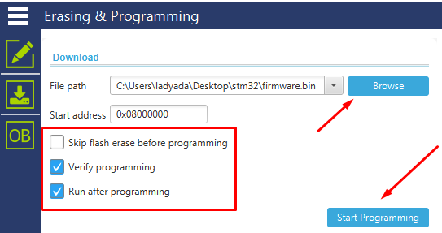
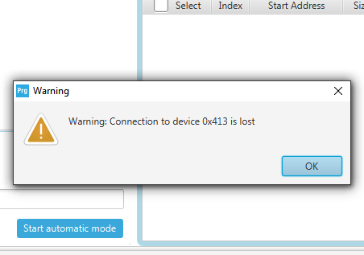

# STM32CubeProg
---

# Windows | Mac | Linux

The easiest way by far to program the board is to download STM32CubeProg. It's a graphical programmer, does not require Zadig or special command line invocation. Download the earliest version available from their website after 2.1.0 (e.g. 2.5.0 is fine), otherwise the write process will not complete successfully.

You'll need to make an ST.com account is the only downside.

[Download STM32CubeProg](https://www.st.com/en/development-tools/stm32cubeprog.html)

When you start it up, it'll look like this.

In the top right, below the Not Connected message, find the dropdown to the left of the Connect button
Select "USB"

If the device is plugged in and the bootloader is running, it will show up under the USB configuration pane. If not, enter bootloader mode by holding BOOT and pressing RST (you shoudl see a blue LED on the board). Click the refresh button.
Once it appears as a valid Port, click Connect

You should see the Device info pane in the bottom right is updated with info about what chip was found!

Click the 3-lines below the STM32 logo in the top left, to expand the menu.
Then click Erasing & Programming

Click Browse to open the firmware files you want to program.
You can program .hex or .bin files.
Don't change the Start Address.
Make sure Verify Programming and Run after Programming are clicked, but Skip flash erase is not.
Then click Start Programming.

It will take a few seconds to erase and reprogram the chip.
It's normal to get a Warning Connection is lost alert.
Click away until you get the File download complete alert.

That's it! You can close STM32 CubeProg.
